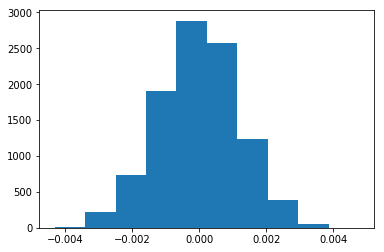

## Analyze A/B Test Results

You may either submit your notebook through the workspace here, or you may work from your local machine and submit through the next page.  Either way assure that your code passes the project [RUBRIC](https://review.udacity.com/#!/projects/37e27304-ad47-4eb0-a1ab-8c12f60e43d0/rubric).  **Please save regularly.**

This project will assure you have mastered the subjects covered in the statistics lessons.  The hope is to have this project be as comprehensive of these topics as possible.  Good luck!

## Table of Contents
- [Introduction](#intro)
- [Part I - Probability](#probability)
- [Part II - A/B Test](#ab_test)
- [Part III - Regression](#regression)


<a id='intro'></a>
### Introduction

A/B tests are very commonly performed by data analysts and data scientists.  It is important that you get some practice working with the difficulties of these 

For this project, you will be working to understand the results of an A/B test run by an e-commerce website.  Your goal is to work through this notebook to help the company understand if they should implement the new page, keep the old page, or perhaps run the experiment longer to make their decision.

**As you work through this notebook, follow along in the classroom and answer the corresponding quiz questions associated with each question.** The labels for each classroom concept are provided for each question.  This will assure you are on the right track as you work through the project, and you can feel more confident in your final submission meeting the criteria.  As a final check, assure you meet all the criteria on the [RUBRIC](https://review.udacity.com/#!/projects/37e27304-ad47-4eb0-a1ab-8c12f60e43d0/rubric).

<a id='probability'></a>
#### Part I - Probability

To get started, let's import our libraries.


```python
import pandas as pd
import numpy as np
import random
import matplotlib.pyplot as plt
%matplotlib inline
#We are setting the seed to assure you get the same answers on quizzes as we set up
random.seed(42)
```

`1.` Now, read in the `ab_data.csv` data. Store it in `df`.  **Use your dataframe to answer the questions in Quiz 1 of the classroom.**

a. Read in the dataset and take a look at the top few rows here:


```python
df = pd.read_csv('ab_data.csv')
df.head()
```


<div>
<style scoped>
    .dataframe tbody tr th:only-of-type {
        vertical-align: middle;
    }

    .dataframe tbody tr th {
        vertical-align: top;
    }

    .dataframe thead th {
        text-align: right;
    }
</style>
<table border="1" class="dataframe">
  <thead>
    <tr style="text-align: right;">
      <th></th>
      <th>user_id</th>
      <th>timestamp</th>
      <th>group</th>
      <th>landing_page</th>
      <th>converted</th>
    </tr>
  </thead>
  <tbody>
    <tr>
      <th>0</th>
      <td>851104</td>
      <td>2017-01-21 22:11:48.556739</td>
      <td>control</td>
      <td>old_page</td>
      <td>0</td>
    </tr>
    <tr>
      <th>1</th>
      <td>804228</td>
      <td>2017-01-12 08:01:45.159739</td>
      <td>control</td>
      <td>old_page</td>
      <td>0</td>
    </tr>
    <tr>
      <th>2</th>
      <td>661590</td>
      <td>2017-01-11 16:55:06.154213</td>
      <td>treatment</td>
      <td>new_page</td>
      <td>0</td>
    </tr>
    <tr>
      <th>3</th>
      <td>853541</td>
      <td>2017-01-08 18:28:03.143765</td>
      <td>treatment</td>
      <td>new_page</td>
      <td>0</td>
    </tr>
    <tr>
      <th>4</th>
      <td>864975</td>
      <td>2017-01-21 01:52:26.210827</td>
      <td>control</td>
      <td>old_page</td>
      <td>1</td>
    </tr>
  </tbody>
</table>
</div>


b. Use the cell below to find the number of rows in the dataset.


```python
df.shape
```


    (294478, 5)


There are 294478 rows

c. The number of unique users in the dataset.


```python
df['user_id'].nunique()
```


    290584


There are 290584 unique users

d. The proportion of users converted.


```python
 df.converted.mean()
```


    0.11965919355605512


11.97% of users are converted

e. The number of times the `new_page` and `treatment` don't match.


```python
df[((df['group'] == 'treatment') == True) != ((df['landing_page'] == 'new_page') == True)].count()
```


    user_id         3893
    timestamp       3893
    group           3893
    landing_page    3893
    converted       3893
    dtype: int64


There are 3893 times where new_page and treatment dont match

f. Do any of the rows have missing values?


```python
df.info()
```

    <class 'pandas.core.frame.DataFrame'>
    RangeIndex: 294478 entries, 0 to 294477
    Data columns (total 5 columns):
    user_id         294478 non-null int64
    timestamp       294478 non-null object
    group           294478 non-null object
    landing_page    294478 non-null object
    converted       294478 non-null int64
    dtypes: int64(2), object(3)
    memory usage: 11.2+ MB
    

There are no rows with missing values.

`2.` For the rows where **treatment** does not match with **new_page** or **control** does not match with **old_page**, we cannot be sure if this row truly received the new or old page.  Use **Quiz 2** in the classroom to figure out how we should handle these rows.  

a. Now use the answer to the quiz to create a new dataset that meets the specifications from the quiz.  Store your new dataframe in **df2**.


```python
df2 = df[((df['group'] == 'treatment') == (df['landing_page'] == 'new_page'))]
```


```python
df2.shape
```


    (290585, 5)


```python
df2.head()
```


<div>
<style scoped>
    .dataframe tbody tr th:only-of-type {
        vertical-align: middle;
    }

    .dataframe tbody tr th {
        vertical-align: top;
    }

    .dataframe thead th {
        text-align: right;
    }
</style>
<table border="1" class="dataframe">
  <thead>
    <tr style="text-align: right;">
      <th></th>
      <th>user_id</th>
      <th>timestamp</th>
      <th>group</th>
      <th>landing_page</th>
      <th>converted</th>
    </tr>
  </thead>
  <tbody>
    <tr>
      <th>0</th>
      <td>851104</td>
      <td>2017-01-21 22:11:48.556739</td>
      <td>control</td>
      <td>old_page</td>
      <td>0</td>
    </tr>
    <tr>
      <th>1</th>
      <td>804228</td>
      <td>2017-01-12 08:01:45.159739</td>
      <td>control</td>
      <td>old_page</td>
      <td>0</td>
    </tr>
    <tr>
      <th>2</th>
      <td>661590</td>
      <td>2017-01-11 16:55:06.154213</td>
      <td>treatment</td>
      <td>new_page</td>
      <td>0</td>
    </tr>
    <tr>
      <th>3</th>
      <td>853541</td>
      <td>2017-01-08 18:28:03.143765</td>
      <td>treatment</td>
      <td>new_page</td>
      <td>0</td>
    </tr>
    <tr>
      <th>4</th>
      <td>864975</td>
      <td>2017-01-21 01:52:26.210827</td>
      <td>control</td>
      <td>old_page</td>
      <td>1</td>
    </tr>
  </tbody>
</table>
</div>


df2 is created with 290585 rows (as 3893 unmatched rows are removed)


```python
# Double Check all of the correct rows were removed - this should be 0
df2[((df2['group'] == 'treatment') == (df2['landing_page'] == 'new_page')) == False].shape[0]
```


    0


`3.` Use **df2** and the cells below to answer questions for **Quiz3** in the classroom.

a. How many unique **user_id**s are in **df2**?


```python
df2['user_id'].nunique()
```


    290584


There are 290584 unique users

b. There is one **user_id** repeated in **df2**.  What is it?


```python
df2[df2['user_id'].duplicated()]
```


<div>
<style scoped>
    .dataframe tbody tr th:only-of-type {
        vertical-align: middle;
    }

    .dataframe tbody tr th {
        vertical-align: top;
    }

    .dataframe thead th {
        text-align: right;
    }
</style>
<table border="1" class="dataframe">
  <thead>
    <tr style="text-align: right;">
      <th></th>
      <th>user_id</th>
      <th>timestamp</th>
      <th>group</th>
      <th>landing_page</th>
      <th>converted</th>
    </tr>
  </thead>
  <tbody>
    <tr>
      <th>2893</th>
      <td>773192</td>
      <td>2017-01-14 02:55:59.590927</td>
      <td>treatment</td>
      <td>new_page</td>
      <td>0</td>
    </tr>
  </tbody>
</table>
</div>


user_id 773192 is repeated

c. What is the row information for the repeat **user_id**? 


```python
df2[df2['user_id'].duplicated()]
```


```python
df2.shape
```


    (290584, 5)


d. Remove **one** of the rows with a duplicate **user_id**, but keep your dataframe as **df2**.

See above 3c.

`4.` Use **df2** in the cells below to answer the quiz questions related to **Quiz 4** in the classroom.

a. What is the probability of an individual converting regardless of the page they receive?


```python
df2.head()
```


<div>
<style scoped>
    .dataframe tbody tr th:only-of-type {
        vertical-align: middle;
    }

    .dataframe tbody tr th {
        vertical-align: top;
    }

    .dataframe thead th {
        text-align: right;
    }
</style>
<table border="1" class="dataframe">
  <thead>
    <tr style="text-align: right;">
      <th></th>
      <th>user_id</th>
      <th>timestamp</th>
      <th>group</th>
      <th>landing_page</th>
      <th>converted</th>
    </tr>
  </thead>
  <tbody>
    <tr>
      <th>0</th>
      <td>851104</td>
      <td>2017-01-21 22:11:48.556739</td>
      <td>control</td>
      <td>old_page</td>
      <td>0</td>
    </tr>
    <tr>
      <th>1</th>
      <td>804228</td>
      <td>2017-01-12 08:01:45.159739</td>
      <td>control</td>
      <td>old_page</td>
      <td>0</td>
    </tr>
    <tr>
      <th>2</th>
      <td>661590</td>
      <td>2017-01-11 16:55:06.154213</td>
      <td>treatment</td>
      <td>new_page</td>
      <td>0</td>
    </tr>
    <tr>
      <th>3</th>
      <td>853541</td>
      <td>2017-01-08 18:28:03.143765</td>
      <td>treatment</td>
      <td>new_page</td>
      <td>0</td>
    </tr>
    <tr>
      <th>4</th>
      <td>864975</td>
      <td>2017-01-21 01:52:26.210827</td>
      <td>control</td>
      <td>old_page</td>
      <td>1</td>
    </tr>
  </tbody>
</table>
</div>


```python
df2['converted'].mean()
```


    0.11959708724499628


There is a probability of 11.96% of an individual converting regardless of the page the receive.

b. Given that an individual was in the `control` group, what is the probability they converted?


```python
df2[df2['group'] == 'control']['converted'].mean()
```


    0.1203863045004612


Given that an individual was in the control group, the probability they converted is 12.04%

c. Given that an individual was in the `treatment` group, what is the probability they converted?


```python
df2[df2['group'] == 'treatment']['converted'].mean()
```


    0.11880806551510564


```python
Given that an individual was in the treatment group, the probability they converted is 11.88%
```

d. What is the probability that an individual received the new page?


```python
df2[df2['landing_page'] == 'new_page']
```


<div>
<style scoped>
    .dataframe tbody tr th:only-of-type {
        vertical-align: middle;
    }

    .dataframe tbody tr th {
        vertical-align: top;
    }

    .dataframe thead th {
        text-align: right;
    }
</style>
<table border="1" class="dataframe">
  <thead>
    <tr style="text-align: right;">
      <th></th>
      <th>user_id</th>
      <th>timestamp</th>
      <th>group</th>
      <th>landing_page</th>
      <th>converted</th>
    </tr>
  </thead>
  <tbody>
    <tr>
      <th>2</th>
      <td>661590</td>
      <td>2017-01-11 16:55:06.154213</td>
      <td>treatment</td>
      <td>new_page</td>
      <td>0</td>
    </tr>
    <tr>
      <th>3</th>
      <td>853541</td>
      <td>2017-01-08 18:28:03.143765</td>
      <td>treatment</td>
      <td>new_page</td>
      <td>0</td>
    </tr>
    <tr>
      <th>6</th>
      <td>679687</td>
      <td>2017-01-19 03:26:46.940749</td>
      <td>treatment</td>
      <td>new_page</td>
      <td>1</td>
    </tr>
    <tr>
      <th>8</th>
      <td>817355</td>
      <td>2017-01-04 17:58:08.979471</td>
      <td>treatment</td>
      <td>new_page</td>
      <td>1</td>
    </tr>
    <tr>
      <th>9</th>
      <td>839785</td>
      <td>2017-01-15 18:11:06.610965</td>
      <td>treatment</td>
      <td>new_page</td>
      <td>1</td>
    </tr>
    <tr>
      <th>10</th>
      <td>929503</td>
      <td>2017-01-18 05:37:11.527370</td>
      <td>treatment</td>
      <td>new_page</td>
      <td>0</td>
    </tr>
    <tr>
      <th>11</th>
      <td>834487</td>
      <td>2017-01-21 22:37:47.774891</td>
      <td>treatment</td>
      <td>new_page</td>
      <td>0</td>
    </tr>
    <tr>
      <th>12</th>
      <td>803683</td>
      <td>2017-01-09 06:05:16.222706</td>
      <td>treatment</td>
      <td>new_page</td>
      <td>0</td>
    </tr>
    <tr>
      <th>13</th>
      <td>944475</td>
      <td>2017-01-22 01:31:09.573836</td>
      <td>treatment</td>
      <td>new_page</td>
      <td>0</td>
    </tr>
    <tr>
      <th>14</th>
      <td>718956</td>
      <td>2017-01-22 11:45:11.327945</td>
      <td>treatment</td>
      <td>new_page</td>
      <td>0</td>
    </tr>
    <tr>
      <th>17</th>
      <td>888545</td>
      <td>2017-01-08 06:37:26.332945</td>
      <td>treatment</td>
      <td>new_page</td>
      <td>1</td>
    </tr>
    <tr>
      <th>20</th>
      <td>740805</td>
      <td>2017-01-12 18:59:45.453277</td>
      <td>treatment</td>
      <td>new_page</td>
      <td>0</td>
    </tr>
    <tr>
      <th>21</th>
      <td>759875</td>
      <td>2017-01-09 16:11:58.806110</td>
      <td>treatment</td>
      <td>new_page</td>
      <td>0</td>
    </tr>
    <tr>
      <th>23</th>
      <td>793849</td>
      <td>2017-01-23 22:36:10.742811</td>
      <td>treatment</td>
      <td>new_page</td>
      <td>0</td>
    </tr>
    <tr>
      <th>24</th>
      <td>905617</td>
      <td>2017-01-20 14:12:19.345499</td>
      <td>treatment</td>
      <td>new_page</td>
      <td>0</td>
    </tr>
    <tr>
      <th>26</th>
      <td>892356</td>
      <td>2017-01-05 09:35:14.904865</td>
      <td>treatment</td>
      <td>new_page</td>
      <td>1</td>
    </tr>
    <tr>
      <th>27</th>
      <td>773302</td>
      <td>2017-01-12 08:29:49.810594</td>
      <td>treatment</td>
      <td>new_page</td>
      <td>0</td>
    </tr>
    <tr>
      <th>29</th>
      <td>736159</td>
      <td>2017-01-06 01:50:21.318242</td>
      <td>treatment</td>
      <td>new_page</td>
      <td>0</td>
    </tr>
    <tr>
      <th>31</th>
      <td>826115</td>
      <td>2017-01-05 11:27:16.756633</td>
      <td>treatment</td>
      <td>new_page</td>
      <td>0</td>
    </tr>
    <tr>
      <th>32</th>
      <td>875124</td>
      <td>2017-01-05 15:39:25.439906</td>
      <td>treatment</td>
      <td>new_page</td>
      <td>1</td>
    </tr>
    <tr>
      <th>33</th>
      <td>931013</td>
      <td>2017-01-07 03:23:57.932344</td>
      <td>treatment</td>
      <td>new_page</td>
      <td>0</td>
    </tr>
    <tr>
      <th>37</th>
      <td>648583</td>
      <td>2017-01-19 09:03:05.545308</td>
      <td>treatment</td>
      <td>new_page</td>
      <td>0</td>
    </tr>
    <tr>
      <th>38</th>
      <td>728086</td>
      <td>2017-01-03 17:07:00.837852</td>
      <td>treatment</td>
      <td>new_page</td>
      <td>0</td>
    </tr>
    <tr>
      <th>39</th>
      <td>870163</td>
      <td>2017-01-02 21:33:49.325594</td>
      <td>treatment</td>
      <td>new_page</td>
      <td>0</td>
    </tr>
    <tr>
      <th>41</th>
      <td>739414</td>
      <td>2017-01-03 13:25:55.139705</td>
      <td>treatment</td>
      <td>new_page</td>
      <td>0</td>
    </tr>
    <tr>
      <th>46</th>
      <td>943635</td>
      <td>2017-01-22 13:37:39.722775</td>
      <td>treatment</td>
      <td>new_page</td>
      <td>0</td>
    </tr>
    <tr>
      <th>47</th>
      <td>800436</td>
      <td>2017-01-20 07:47:47.224386</td>
      <td>treatment</td>
      <td>new_page</td>
      <td>0</td>
    </tr>
    <tr>
      <th>48</th>
      <td>698590</td>
      <td>2017-01-23 11:51:59.925413</td>
      <td>treatment</td>
      <td>new_page</td>
      <td>0</td>
    </tr>
    <tr>
      <th>49</th>
      <td>830513</td>
      <td>2017-01-12 00:50:01.470557</td>
      <td>treatment</td>
      <td>new_page</td>
      <td>0</td>
    </tr>
    <tr>
      <th>52</th>
      <td>916511</td>
      <td>2017-01-22 06:20:04.691382</td>
      <td>treatment</td>
      <td>new_page</td>
      <td>0</td>
    </tr>
    <tr>
      <th>...</th>
      <td>...</td>
      <td>...</td>
      <td>...</td>
      <td>...</td>
      <td>...</td>
    </tr>
    <tr>
      <th>294417</th>
      <td>924332</td>
      <td>2017-01-15 19:38:52.858024</td>
      <td>treatment</td>
      <td>new_page</td>
      <td>0</td>
    </tr>
    <tr>
      <th>294422</th>
      <td>849625</td>
      <td>2017-01-06 17:54:07.563311</td>
      <td>treatment</td>
      <td>new_page</td>
      <td>0</td>
    </tr>
    <tr>
      <th>294424</th>
      <td>929723</td>
      <td>2017-01-10 15:13:48.352399</td>
      <td>treatment</td>
      <td>new_page</td>
      <td>0</td>
    </tr>
    <tr>
      <th>294427</th>
      <td>774769</td>
      <td>2017-01-03 06:01:36.251836</td>
      <td>treatment</td>
      <td>new_page</td>
      <td>0</td>
    </tr>
    <tr>
      <th>294430</th>
      <td>733871</td>
      <td>2017-01-21 17:54:08.810964</td>
      <td>treatment</td>
      <td>new_page</td>
      <td>1</td>
    </tr>
    <tr>
      <th>294432</th>
      <td>844588</td>
      <td>2017-01-16 20:48:19.567178</td>
      <td>treatment</td>
      <td>new_page</td>
      <td>0</td>
    </tr>
    <tr>
      <th>294433</th>
      <td>641244</td>
      <td>2017-01-07 16:57:26.193171</td>
      <td>treatment</td>
      <td>new_page</td>
      <td>0</td>
    </tr>
    <tr>
      <th>294434</th>
      <td>676072</td>
      <td>2017-01-14 17:26:02.495442</td>
      <td>treatment</td>
      <td>new_page</td>
      <td>0</td>
    </tr>
    <tr>
      <th>294435</th>
      <td>886374</td>
      <td>2017-01-07 13:43:39.202634</td>
      <td>treatment</td>
      <td>new_page</td>
      <td>0</td>
    </tr>
    <tr>
      <th>294437</th>
      <td>676732</td>
      <td>2017-01-03 23:06:45.459467</td>
      <td>treatment</td>
      <td>new_page</td>
      <td>0</td>
    </tr>
    <tr>
      <th>294439</th>
      <td>862218</td>
      <td>2017-01-04 10:43:07.846494</td>
      <td>treatment</td>
      <td>new_page</td>
      <td>0</td>
    </tr>
    <tr>
      <th>294441</th>
      <td>798826</td>
      <td>2017-01-23 16:50:13.788528</td>
      <td>treatment</td>
      <td>new_page</td>
      <td>0</td>
    </tr>
    <tr>
      <th>294442</th>
      <td>836721</td>
      <td>2017-01-12 17:37:50.966955</td>
      <td>treatment</td>
      <td>new_page</td>
      <td>0</td>
    </tr>
    <tr>
      <th>294444</th>
      <td>844901</td>
      <td>2017-01-15 17:46:36.622726</td>
      <td>treatment</td>
      <td>new_page</td>
      <td>0</td>
    </tr>
    <tr>
      <th>294445</th>
      <td>653124</td>
      <td>2017-01-14 13:44:51.745491</td>
      <td>treatment</td>
      <td>new_page</td>
      <td>0</td>
    </tr>
    <tr>
      <th>294446</th>
      <td>909437</td>
      <td>2017-01-18 14:49:49.064452</td>
      <td>treatment</td>
      <td>new_page</td>
      <td>0</td>
    </tr>
    <tr>
      <th>294448</th>
      <td>776137</td>
      <td>2017-01-12 05:53:12.386730</td>
      <td>treatment</td>
      <td>new_page</td>
      <td>0</td>
    </tr>
    <tr>
      <th>294449</th>
      <td>883344</td>
      <td>2017-01-22 23:15:58.645325</td>
      <td>treatment</td>
      <td>new_page</td>
      <td>0</td>
    </tr>
    <tr>
      <th>294450</th>
      <td>825594</td>
      <td>2017-01-06 12:37:08.897784</td>
      <td>treatment</td>
      <td>new_page</td>
      <td>0</td>
    </tr>
    <tr>
      <th>294454</th>
      <td>937338</td>
      <td>2017-01-19 03:23:22.236666</td>
      <td>treatment</td>
      <td>new_page</td>
      <td>0</td>
    </tr>
    <tr>
      <th>294455</th>
      <td>733101</td>
      <td>2017-01-23 12:52:58.711914</td>
      <td>treatment</td>
      <td>new_page</td>
      <td>0</td>
    </tr>
    <tr>
      <th>294456</th>
      <td>679096</td>
      <td>2017-01-02 16:43:49.237940</td>
      <td>treatment</td>
      <td>new_page</td>
      <td>0</td>
    </tr>
    <tr>
      <th>294457</th>
      <td>691699</td>
      <td>2017-01-09 23:42:35.963486</td>
      <td>treatment</td>
      <td>new_page</td>
      <td>0</td>
    </tr>
    <tr>
      <th>294458</th>
      <td>807595</td>
      <td>2017-01-22 10:43:09.285426</td>
      <td>treatment</td>
      <td>new_page</td>
      <td>0</td>
    </tr>
    <tr>
      <th>294460</th>
      <td>846225</td>
      <td>2017-01-16 15:24:46.705903</td>
      <td>treatment</td>
      <td>new_page</td>
      <td>0</td>
    </tr>
    <tr>
      <th>294462</th>
      <td>677163</td>
      <td>2017-01-03 19:41:51.902148</td>
      <td>treatment</td>
      <td>new_page</td>
      <td>0</td>
    </tr>
    <tr>
      <th>294465</th>
      <td>925675</td>
      <td>2017-01-07 20:38:26.346410</td>
      <td>treatment</td>
      <td>new_page</td>
      <td>0</td>
    </tr>
    <tr>
      <th>294468</th>
      <td>643562</td>
      <td>2017-01-02 19:20:05.460595</td>
      <td>treatment</td>
      <td>new_page</td>
      <td>0</td>
    </tr>
    <tr>
      <th>294472</th>
      <td>822004</td>
      <td>2017-01-04 03:36:46.071379</td>
      <td>treatment</td>
      <td>new_page</td>
      <td>0</td>
    </tr>
    <tr>
      <th>294477</th>
      <td>715931</td>
      <td>2017-01-16 12:40:24.467417</td>
      <td>treatment</td>
      <td>new_page</td>
      <td>0</td>
    </tr>
  </tbody>
</table>
<p>145310 rows × 5 columns</p>
</div>


```python
len(df2[df2['landing_page'] == 'new_page'])
```


    145310


```python
len(df2)
```


    290584


```python
145310/290584
```


    0.5000619442226688


The probability that an individual received the new page is 50.01%.

e. Consider your results from parts (a) through (d) above, and explain below whether you think there is sufficient evidence to conclude that the new treatment page leads to more conversions.

There is no sufficient evidence to conclude that the new treatment page leads to more conversions. The probability of conversation for individuals receiving control and treatment are very similar. Also the probability that an individual received the new page is 50.01%. Therefore,  there
is no sufficient evidence to conclude that the new treatment page leads to more conversions.

<a id='ab_test'></a>
### Part II - A/B Test

Notice that because of the time stamp associated with each event, you could technically run a hypothesis test continuously as each observation was observed.  

However, then the hard question is do you stop as soon as one page is considered significantly better than another or does it need to happen consistently for a certain amount of time?  How long do you run to render a decision that neither page is better than another?  

These questions are the difficult parts associated with A/B tests in general.  


`1.` For now, consider you need to make the decision just based on all the data provided.  If you want to assume that the old page is better unless the new page proves to be definitely better at a Type I error rate of 5%, what should your null and alternative hypotheses be?  You can state your hypothesis in terms of words or in terms of **$p_{old}$** and **$p_{new}$**, which are the converted rates for the old and new pages.

**Put your answer here.**

`2.` Assume under the null hypothesis, $p_{new}$ and $p_{old}$ both have "true" success rates equal to the **converted** success rate regardless of page - that is $p_{new}$ and $p_{old}$ are equal. Furthermore, assume they are equal to the **converted** rate in **ab_data.csv** regardless of the page. <br><br>

Use a sample size for each page equal to the ones in **ab_data.csv**.  <br><br>

Perform the sampling distribution for the difference in **converted** between the two pages over 10,000 iterations of calculating an estimate from the null.  <br><br>

Use the cells below to provide the necessary parts of this simulation.  If this doesn't make complete sense right now, don't worry - you are going to work through the problems below to complete this problem.  You can use **Quiz 5** in the classroom to make sure you are on the right track.<br><br>

a. What is the **conversion rate** for $p_{new}$ under the null? 


```python
p_new = df2['converted'].mean()
```


```python
p_new
```


    0.11959708724499628


The conversion rate for  𝑝𝑛𝑒𝑤  under the null is 11.96%.

b. What is the **conversion rate** for $p_{old}$ under the null? <br><br>


```python
p_old = df2['converted'].mean()
```


```python
p_old
```


    0.11959708724499628


The conversion rate for 𝑝𝑜𝑙𝑑 under the null is 11.96%.

c. What is $n_{new}$, the number of individuals in the treatment group?


```python
n_new = len(df2[df2['landing_page'] == 'new_page'])
```


```python
n_new
```


    145310


The number of individuals in the treatment group is 145310.

d. What is $n_{old}$, the number of individuals in the control group?


```python
n_old = len(df2[df2['landing_page'] == 'old_page'])
```


```python
n_old
```


    145274


The number of individuals in the treatment group is 145274.

e. Simulate $n_{new}$ transactions with a conversion rate of $p_{new}$ under the null.  Store these $n_{new}$ 1's and 0's in **new_page_converted**.


```python
new_page_converted = np.random.binomial(n_new,p_new)
```


```python
new_page_converted
```


    17542


f. Simulate $n_{old}$ transactions with a conversion rate of $p_{old}$ under the null.  Store these $n_{old}$ 1's and 0's in **old_page_converted**.


```python
old_page_converted = np.random.binomial(n_old,p_old)
```


```python
old_page_converted
```


    17435


g. Find $p_{new}$ - $p_{old}$ for your simulated values from part (e) and (f).


```python
(new_page_converted/n_new)
```


    0.12072121670910467


```python
(old_page_converted/n_old)
```


    0.12001459311370238


```python
0.12072121670910467 - 0.12001459311370238
```


    0.0007066235954022865


h. Create 10,000 $p_{new}$ - $p_{old}$ values using the same simulation process you used in parts (a) through (g) above. Store all 10,000 values in a NumPy array called **p_diffs**.


```python
p_diffs = []
for _ in range(10000):
    new_page_converted = np.random.binomial(n_new,p_new)
    old_page_converted = np.random.binomial(n_old, p_old)
    p_diff = new_page_converted/n_new - old_page_converted/n_old
    p_diffs.append(p_diff)
```

i. Plot a histogram of the **p_diffs**.  Does this plot look like what you expected?  Use the matching problem in the classroom to assure you fully understand what was computed here.


```python
plt.hist(p_diffs)
```


    (array([   17.,   221.,   741.,  1902.,  2884.,  2568.,  1230.,   385.,
               49.,     3.]),
     array([-0.00431076, -0.00340222, -0.00249367, -0.00158513, -0.00067659,
             0.00023195,  0.0011405 ,  0.00204904,  0.00295758,  0.00386612,
             0.00477467]),
     <a list of 10 Patch objects>)





j. What proportion of the **p_diffs** are greater than the actual difference observed in **ab_data.csv**?


```python
actual_diffs = df2[df2['landing_page'] == 'new_page']['converted'].mean() -  df2[df2['landing_page'] == 'old_page']['converted'].mean()
```


```python
actual_diffs
```


    -0.0015782389853555567


The actual difference observed is -0.0016367945992569882.


```python
p_diffs_proportion = (actual_diffs < p_diffs).mean()
```


```python
p_diffs_proportion
```


    0.90110000000000001


The proportion of the p_diffs greater than the actual difference observed in ab_data.csv are 0.9011.

k. Please explain using the vocabulary you've learned in this course what you just computed in part **j.**  What is this value called in scientific studies?  What does this value mean in terms of whether or not there is a difference between the new and old pages?

The proportion of the p_diffs greater than the actual difference is also defined as the p-value.  As the calculated value is greater than 0.05, we cannot reject the null hypothesis. As such,  we conclude that there is no difference between the new and old pages.

l. We could also use a built-in to achieve similar results.  Though using the built-in might be easier to code, the above portions are a walkthrough of the ideas that are critical to correctly thinking about statistical significance. Fill in the below to calculate the number of conversions for each page, as well as the number of individuals who received each page. Let `n_old` and `n_new` refer the the number of rows associated with the old page and new pages, respectively.


```python
import statsmodels.api as sm

converted_old = len(df2[df2.landing_page == 'old_page'][df2.converted == 1])
converted_new = len(df2[df2.landing_page == 'new_page'][df2.converted == 1])
n_old = len(df2[df2.landing_page == 'old_page'])
n_new = len(df2[df2.landing_page == 'new_page'])
```

    /opt/conda/lib/python3.6/site-packages/ipykernel_launcher.py:3: UserWarning: Boolean Series key will be reindexed to match DataFrame index.
      This is separate from the ipykernel package so we can avoid doing imports until
    /opt/conda/lib/python3.6/site-packages/ipykernel_launcher.py:4: UserWarning: Boolean Series key will be reindexed to match DataFrame index.
      after removing the cwd from sys.path.
    


```python
converted_new
```


    17264


```python
converted_old
```


    17489


```python
n_old
```


    145274


```python
n_new
```


    145310


m. Now use `stats.proportions_ztest` to compute your test statistic and p-value.  [Here](https://docs.w3cub.com/statsmodels/generated/statsmodels.stats.proportion.proportions_ztest/) is a helpful link on using the built in.


```python
test_statistic, p_value = sm.stats.proportions_ztest([converted_new, converted_old], [n_new,n_old], alternative='larger')
```


```python
test_statistic
```


    -1.3109241984234394


The test statistic is -1.3109241984234394.


```python
p_value
```


    0.90505831275902449


The p_value is 0.90505831275902449.

n. What do the z-score and p-value you computed in the previous question mean for the conversion rates of the old and new pages?  Do they agree with the findings in parts **j.** and **k.**?


```python
norm.ppf(1-(0.05/2))
```


    1.959963984540054


The critical value at 95% confidence is 1.96.

Since the test statistic is smaller than the critical value at 95% confidence, we cannot reject the null hypothesis. Similarly, the p-value is greater than 0.05, we cannot reject the null hypothesis. As such, we conclude that there is no difference between the new and old pages. We agree with the findings in parts j. and k.

<a id='regression'></a>
### Part III - A regression approach

`1.` In this final part, you will see that the result you achieved in the A/B test in Part II above can also be achieved by performing regression.<br><br> 

a. Since each row is either a conversion or no conversion, what type of regression should you be performing in this case?

Logistic regression should be performed.

b. The goal is to use **statsmodels** to fit the regression model you specified in part **a.** to see if there is a significant difference in conversion based on which page a customer receives. However, you first need to create in df2 a column for the intercept, and create a dummy variable column for which page each user received.  Add an **intercept** column, as well as an **ab_page** column, which is 1 when an individual receives the **treatment** and 0 if **control**.


```python
df3 = df2
```


```python
df3.head()
```


<div>
<style scoped>
    .dataframe tbody tr th:only-of-type {
        vertical-align: middle;
    }

    .dataframe tbody tr th {
        vertical-align: top;
    }

    .dataframe thead th {
        text-align: right;
    }
</style>
<table border="1" class="dataframe">
  <thead>
    <tr style="text-align: right;">
      <th></th>
      <th>user_id</th>
      <th>timestamp</th>
      <th>group</th>
      <th>landing_page</th>
      <th>converted</th>
    </tr>
  </thead>
  <tbody>
    <tr>
      <th>0</th>
      <td>851104</td>
      <td>2017-01-21 22:11:48.556739</td>
      <td>control</td>
      <td>old_page</td>
      <td>0</td>
    </tr>
    <tr>
      <th>1</th>
      <td>804228</td>
      <td>2017-01-12 08:01:45.159739</td>
      <td>control</td>
      <td>old_page</td>
      <td>0</td>
    </tr>
    <tr>
      <th>2</th>
      <td>661590</td>
      <td>2017-01-11 16:55:06.154213</td>
      <td>treatment</td>
      <td>new_page</td>
      <td>0</td>
    </tr>
    <tr>
      <th>3</th>
      <td>853541</td>
      <td>2017-01-08 18:28:03.143765</td>
      <td>treatment</td>
      <td>new_page</td>
      <td>0</td>
    </tr>
    <tr>
      <th>4</th>
      <td>864975</td>
      <td>2017-01-21 01:52:26.210827</td>
      <td>control</td>
      <td>old_page</td>
      <td>1</td>
    </tr>
  </tbody>
</table>
</div>


```python
df3['intercept'] = 1
df3[['drop', 'ab_page']] = pd.get_dummies(df3['group'])
df3.drop('drop', axis=1, inplace=True)
df3.head()
```


<div>
<style scoped>
    .dataframe tbody tr th:only-of-type {
        vertical-align: middle;
    }

    .dataframe tbody tr th {
        vertical-align: top;
    }

    .dataframe thead th {
        text-align: right;
    }
</style>
<table border="1" class="dataframe">
  <thead>
    <tr style="text-align: right;">
      <th></th>
      <th>user_id</th>
      <th>timestamp</th>
      <th>group</th>
      <th>landing_page</th>
      <th>converted</th>
      <th>intercept</th>
      <th>ab_page</th>
    </tr>
  </thead>
  <tbody>
    <tr>
      <th>0</th>
      <td>851104</td>
      <td>2017-01-21 22:11:48.556739</td>
      <td>control</td>
      <td>old_page</td>
      <td>0</td>
      <td>1</td>
      <td>0</td>
    </tr>
    <tr>
      <th>1</th>
      <td>804228</td>
      <td>2017-01-12 08:01:45.159739</td>
      <td>control</td>
      <td>old_page</td>
      <td>0</td>
      <td>1</td>
      <td>0</td>
    </tr>
    <tr>
      <th>2</th>
      <td>661590</td>
      <td>2017-01-11 16:55:06.154213</td>
      <td>treatment</td>
      <td>new_page</td>
      <td>0</td>
      <td>1</td>
      <td>1</td>
    </tr>
    <tr>
      <th>3</th>
      <td>853541</td>
      <td>2017-01-08 18:28:03.143765</td>
      <td>treatment</td>
      <td>new_page</td>
      <td>0</td>
      <td>1</td>
      <td>1</td>
    </tr>
    <tr>
      <th>4</th>
      <td>864975</td>
      <td>2017-01-21 01:52:26.210827</td>
      <td>control</td>
      <td>old_page</td>
      <td>1</td>
      <td>1</td>
      <td>0</td>
    </tr>
  </tbody>
</table>
</div>


c. Use **statsmodels** to instantiate your regression model on the two columns you created in part b., then fit the model using the two columns you created in part **b.** to predict whether or not an individual converts. 


```python
logit = sm.Logit(df3['converted'], df3[['intercept', 'ab_page']])
results = logit.fit()
```

    Optimization terminated successfully.
             Current function value: 0.366118
             Iterations 6
    

d. Provide the summary of your model below, and use it as necessary to answer the following questions.


```python
from scipy import stats
stats.chisqprob = lambda chisq, df: stats.chi2.sf(chisq, df)
```


```python
results.summary()
```


<table class="simpletable">
<caption>Logit Regression Results</caption>
<tr>
  <th>Dep. Variable:</th>     <td>converted</td>    <th>  No. Observations:  </th>   <td>290584</td>   
</tr>
<tr>
  <th>Model:</th>               <td>Logit</td>      <th>  Df Residuals:      </th>   <td>290582</td>   
</tr>
<tr>
  <th>Method:</th>               <td>MLE</td>       <th>  Df Model:          </th>   <td>     1</td>   
</tr>
<tr>
  <th>Date:</th>          <td>Sat, 08 Aug 2020</td> <th>  Pseudo R-squ.:     </th>  <td>8.077e-06</td> 
</tr>
<tr>
  <th>Time:</th>              <td>15:55:00</td>     <th>  Log-Likelihood:    </th> <td>-1.0639e+05</td>
</tr>
<tr>
  <th>converged:</th>           <td>True</td>       <th>  LL-Null:           </th> <td>-1.0639e+05</td>
</tr>
<tr>
  <th> </th>                      <td> </td>        <th>  LLR p-value:       </th>   <td>0.1899</td>   
</tr>
</table>
<table class="simpletable">
<tr>
      <td></td>         <th>coef</th>     <th>std err</th>      <th>z</th>      <th>P>|z|</th>  <th>[0.025</th>    <th>0.975]</th>  
</tr>
<tr>
  <th>intercept</th> <td>   -1.9888</td> <td>    0.008</td> <td> -246.669</td> <td> 0.000</td> <td>   -2.005</td> <td>   -1.973</td>
</tr>
<tr>
  <th>ab_page</th>   <td>   -0.0150</td> <td>    0.011</td> <td>   -1.311</td> <td> 0.190</td> <td>   -0.037</td> <td>    0.007</td>
</tr>
</table>


e. What is the p-value associated with **ab_page**? Why does it differ from the value you found in **Part II**?<br><br>  **Hint**: What are the null and alternative hypotheses associated with your regression model, and how do they compare to the null and alternative hypotheses in **Part II**?

The p-value associated with ab_page here is 0.190, which is different from the value found in Part II. This part is a 2 sided test whereas Part II is a one sided test. In other words, we are testing if the old page has the same effectiveness as the new page in this part. However, we are testing if the old page has greater or equal effectiveness than the new page in Part II.

f. Now, you are considering other things that might influence whether or not an individual converts.  Discuss why it is a good idea to consider other factors to add into your regression model.  Are there any disadvantages to adding additional terms into your regression model?

There are a number of factors (e.g. age) that might influence whether or not an individual converts. It is a good idea to consider them to add into the regression model as we may be able to generate new trends or insights with those factors considered. However, there may be some disadvantages e.g.  collinearity, i.e. which means that one factor is related to another.

g. Now along with testing if the conversion rate changes for different pages, also add an effect based on which country a user lives in. You will need to read in the **countries.csv** dataset and merge together your datasets on the appropriate rows.  [Here](https://pandas.pydata.org/pandas-docs/stable/generated/pandas.DataFrame.join.html) are the docs for joining tables. 

Does it appear that country had an impact on conversion?  Don't forget to create dummy variables for these country columns - **Hint: You will need two columns for the three dummy variables.** Provide the statistical output as well as a written response to answer this question.


```python
countries = pd.read_csv('countries.csv')
```


```python
countries.head()
```


<div>
<style scoped>
    .dataframe tbody tr th:only-of-type {
        vertical-align: middle;
    }

    .dataframe tbody tr th {
        vertical-align: top;
    }

    .dataframe thead th {
        text-align: right;
    }
</style>
<table border="1" class="dataframe">
  <thead>
    <tr style="text-align: right;">
      <th></th>
      <th>user_id</th>
      <th>country</th>
    </tr>
  </thead>
  <tbody>
    <tr>
      <th>0</th>
      <td>834778</td>
      <td>UK</td>
    </tr>
    <tr>
      <th>1</th>
      <td>928468</td>
      <td>US</td>
    </tr>
    <tr>
      <th>2</th>
      <td>822059</td>
      <td>UK</td>
    </tr>
    <tr>
      <th>3</th>
      <td>711597</td>
      <td>UK</td>
    </tr>
    <tr>
      <th>4</th>
      <td>710616</td>
      <td>UK</td>
    </tr>
  </tbody>
</table>
</div>


```python
combined_df3 = df3.merge(countries, on='user_id', how='inner')
combined_df3.head()
```


<div>
<style scoped>
    .dataframe tbody tr th:only-of-type {
        vertical-align: middle;
    }

    .dataframe tbody tr th {
        vertical-align: top;
    }

    .dataframe thead th {
        text-align: right;
    }
</style>
<table border="1" class="dataframe">
  <thead>
    <tr style="text-align: right;">
      <th></th>
      <th>user_id</th>
      <th>timestamp</th>
      <th>group</th>
      <th>landing_page</th>
      <th>converted</th>
      <th>intercept</th>
      <th>ab_page</th>
      <th>country</th>
    </tr>
  </thead>
  <tbody>
    <tr>
      <th>0</th>
      <td>851104</td>
      <td>2017-01-21 22:11:48.556739</td>
      <td>control</td>
      <td>old_page</td>
      <td>0</td>
      <td>1</td>
      <td>0</td>
      <td>US</td>
    </tr>
    <tr>
      <th>1</th>
      <td>804228</td>
      <td>2017-01-12 08:01:45.159739</td>
      <td>control</td>
      <td>old_page</td>
      <td>0</td>
      <td>1</td>
      <td>0</td>
      <td>US</td>
    </tr>
    <tr>
      <th>2</th>
      <td>661590</td>
      <td>2017-01-11 16:55:06.154213</td>
      <td>treatment</td>
      <td>new_page</td>
      <td>0</td>
      <td>1</td>
      <td>1</td>
      <td>US</td>
    </tr>
    <tr>
      <th>3</th>
      <td>853541</td>
      <td>2017-01-08 18:28:03.143765</td>
      <td>treatment</td>
      <td>new_page</td>
      <td>0</td>
      <td>1</td>
      <td>1</td>
      <td>US</td>
    </tr>
    <tr>
      <th>4</th>
      <td>864975</td>
      <td>2017-01-21 01:52:26.210827</td>
      <td>control</td>
      <td>old_page</td>
      <td>1</td>
      <td>1</td>
      <td>0</td>
      <td>US</td>
    </tr>
  </tbody>
</table>
</div>


```python
combined_df3 = combined_df3.join(pd.get_dummies(combined_df3['country']))
combined_df3.head()
```


<div>
<style scoped>
    .dataframe tbody tr th:only-of-type {
        vertical-align: middle;
    }

    .dataframe tbody tr th {
        vertical-align: top;
    }

    .dataframe thead th {
        text-align: right;
    }
</style>
<table border="1" class="dataframe">
  <thead>
    <tr style="text-align: right;">
      <th></th>
      <th>user_id</th>
      <th>timestamp</th>
      <th>group</th>
      <th>landing_page</th>
      <th>converted</th>
      <th>intercept</th>
      <th>ab_page</th>
      <th>country</th>
      <th>CA</th>
      <th>UK</th>
      <th>US</th>
    </tr>
  </thead>
  <tbody>
    <tr>
      <th>0</th>
      <td>851104</td>
      <td>2017-01-21 22:11:48.556739</td>
      <td>control</td>
      <td>old_page</td>
      <td>0</td>
      <td>1</td>
      <td>0</td>
      <td>US</td>
      <td>0</td>
      <td>0</td>
      <td>1</td>
    </tr>
    <tr>
      <th>1</th>
      <td>804228</td>
      <td>2017-01-12 08:01:45.159739</td>
      <td>control</td>
      <td>old_page</td>
      <td>0</td>
      <td>1</td>
      <td>0</td>
      <td>US</td>
      <td>0</td>
      <td>0</td>
      <td>1</td>
    </tr>
    <tr>
      <th>2</th>
      <td>661590</td>
      <td>2017-01-11 16:55:06.154213</td>
      <td>treatment</td>
      <td>new_page</td>
      <td>0</td>
      <td>1</td>
      <td>1</td>
      <td>US</td>
      <td>0</td>
      <td>0</td>
      <td>1</td>
    </tr>
    <tr>
      <th>3</th>
      <td>853541</td>
      <td>2017-01-08 18:28:03.143765</td>
      <td>treatment</td>
      <td>new_page</td>
      <td>0</td>
      <td>1</td>
      <td>1</td>
      <td>US</td>
      <td>0</td>
      <td>0</td>
      <td>1</td>
    </tr>
    <tr>
      <th>4</th>
      <td>864975</td>
      <td>2017-01-21 01:52:26.210827</td>
      <td>control</td>
      <td>old_page</td>
      <td>1</td>
      <td>1</td>
      <td>0</td>
      <td>US</td>
      <td>0</td>
      <td>0</td>
      <td>1</td>
    </tr>
  </tbody>
</table>
</div>


```python
sm.Logit(combined_df3['converted'], combined_df3[['intercept', 'ab_page', 'CA', 'UK']]).fit().summary()
```

    Optimization terminated successfully.
             Current function value: 0.366113
             Iterations 6
    


<table class="simpletable">
<caption>Logit Regression Results</caption>
<tr>
  <th>Dep. Variable:</th>     <td>converted</td>    <th>  No. Observations:  </th>   <td>290584</td>   
</tr>
<tr>
  <th>Model:</th>               <td>Logit</td>      <th>  Df Residuals:      </th>   <td>290580</td>   
</tr>
<tr>
  <th>Method:</th>               <td>MLE</td>       <th>  Df Model:          </th>   <td>     3</td>   
</tr>
<tr>
  <th>Date:</th>          <td>Sat, 08 Aug 2020</td> <th>  Pseudo R-squ.:     </th>  <td>2.323e-05</td> 
</tr>
<tr>
  <th>Time:</th>              <td>16:27:17</td>     <th>  Log-Likelihood:    </th> <td>-1.0639e+05</td>
</tr>
<tr>
  <th>converged:</th>           <td>True</td>       <th>  LL-Null:           </th> <td>-1.0639e+05</td>
</tr>
<tr>
  <th> </th>                      <td> </td>        <th>  LLR p-value:       </th>   <td>0.1760</td>   
</tr>
</table>
<table class="simpletable">
<tr>
      <td></td>         <th>coef</th>     <th>std err</th>      <th>z</th>      <th>P>|z|</th>  <th>[0.025</th>    <th>0.975]</th>  
</tr>
<tr>
  <th>intercept</th> <td>   -1.9893</td> <td>    0.009</td> <td> -223.763</td> <td> 0.000</td> <td>   -2.007</td> <td>   -1.972</td>
</tr>
<tr>
  <th>ab_page</th>   <td>   -0.0149</td> <td>    0.011</td> <td>   -1.307</td> <td> 0.191</td> <td>   -0.037</td> <td>    0.007</td>
</tr>
<tr>
  <th>CA</th>        <td>   -0.0408</td> <td>    0.027</td> <td>   -1.516</td> <td> 0.130</td> <td>   -0.093</td> <td>    0.012</td>
</tr>
<tr>
  <th>UK</th>        <td>    0.0099</td> <td>    0.013</td> <td>    0.743</td> <td> 0.457</td> <td>   -0.016</td> <td>    0.036</td>
</tr>
</table>


The p-values above are all greater than the critical value 0.05, therefore we cannot reject the null hypothesis.


```python
h. Though you have now looked at the individual factors of country and page on conversion, we would now like to look at an interaction between page and country to see if there significant effects on conversion.  Create the necessary additional columns, and fit the new model.  

Provide the summary results, and your conclusions based on the results.
```


```python
combined_df3['group_country'] = combined_df3['group'] + '_' + combined_df3['country']
combined_df3.head()
```


<div>
<style scoped>
    .dataframe tbody tr th:only-of-type {
        vertical-align: middle;
    }

    .dataframe tbody tr th {
        vertical-align: top;
    }

    .dataframe thead th {
        text-align: right;
    }
</style>
<table border="1" class="dataframe">
  <thead>
    <tr style="text-align: right;">
      <th></th>
      <th>user_id</th>
      <th>timestamp</th>
      <th>group</th>
      <th>landing_page</th>
      <th>converted</th>
      <th>intercept</th>
      <th>ab_page</th>
      <th>country</th>
      <th>CA</th>
      <th>UK</th>
      <th>US</th>
      <th>group_country</th>
    </tr>
  </thead>
  <tbody>
    <tr>
      <th>0</th>
      <td>851104</td>
      <td>2017-01-21 22:11:48.556739</td>
      <td>control</td>
      <td>old_page</td>
      <td>0</td>
      <td>1</td>
      <td>0</td>
      <td>US</td>
      <td>0</td>
      <td>0</td>
      <td>1</td>
      <td>control_US</td>
    </tr>
    <tr>
      <th>1</th>
      <td>804228</td>
      <td>2017-01-12 08:01:45.159739</td>
      <td>control</td>
      <td>old_page</td>
      <td>0</td>
      <td>1</td>
      <td>0</td>
      <td>US</td>
      <td>0</td>
      <td>0</td>
      <td>1</td>
      <td>control_US</td>
    </tr>
    <tr>
      <th>2</th>
      <td>661590</td>
      <td>2017-01-11 16:55:06.154213</td>
      <td>treatment</td>
      <td>new_page</td>
      <td>0</td>
      <td>1</td>
      <td>1</td>
      <td>US</td>
      <td>0</td>
      <td>0</td>
      <td>1</td>
      <td>treatment_US</td>
    </tr>
    <tr>
      <th>3</th>
      <td>853541</td>
      <td>2017-01-08 18:28:03.143765</td>
      <td>treatment</td>
      <td>new_page</td>
      <td>0</td>
      <td>1</td>
      <td>1</td>
      <td>US</td>
      <td>0</td>
      <td>0</td>
      <td>1</td>
      <td>treatment_US</td>
    </tr>
    <tr>
      <th>4</th>
      <td>864975</td>
      <td>2017-01-21 01:52:26.210827</td>
      <td>control</td>
      <td>old_page</td>
      <td>1</td>
      <td>1</td>
      <td>0</td>
      <td>US</td>
      <td>0</td>
      <td>0</td>
      <td>1</td>
      <td>control_US</td>
    </tr>
  </tbody>
</table>
</div>


```python
combined_df3 = combined_df3.join(pd.get_dummies(combined_df3['group_country']))
combined_df3.head()
```


<div>
<style scoped>
    .dataframe tbody tr th:only-of-type {
        vertical-align: middle;
    }

    .dataframe tbody tr th {
        vertical-align: top;
    }

    .dataframe thead th {
        text-align: right;
    }
</style>
<table border="1" class="dataframe">
  <thead>
    <tr style="text-align: right;">
      <th></th>
      <th>user_id</th>
      <th>timestamp</th>
      <th>group</th>
      <th>landing_page</th>
      <th>converted</th>
      <th>intercept</th>
      <th>ab_page</th>
      <th>country</th>
      <th>CA</th>
      <th>UK</th>
      <th>US</th>
      <th>group_country</th>
      <th>control_CA</th>
      <th>control_UK</th>
      <th>control_US</th>
      <th>treatment_CA</th>
      <th>treatment_UK</th>
      <th>treatment_US</th>
    </tr>
  </thead>
  <tbody>
    <tr>
      <th>0</th>
      <td>851104</td>
      <td>2017-01-21 22:11:48.556739</td>
      <td>control</td>
      <td>old_page</td>
      <td>0</td>
      <td>1</td>
      <td>0</td>
      <td>US</td>
      <td>0</td>
      <td>0</td>
      <td>1</td>
      <td>control_US</td>
      <td>0</td>
      <td>0</td>
      <td>1</td>
      <td>0</td>
      <td>0</td>
      <td>0</td>
    </tr>
    <tr>
      <th>1</th>
      <td>804228</td>
      <td>2017-01-12 08:01:45.159739</td>
      <td>control</td>
      <td>old_page</td>
      <td>0</td>
      <td>1</td>
      <td>0</td>
      <td>US</td>
      <td>0</td>
      <td>0</td>
      <td>1</td>
      <td>control_US</td>
      <td>0</td>
      <td>0</td>
      <td>1</td>
      <td>0</td>
      <td>0</td>
      <td>0</td>
    </tr>
    <tr>
      <th>2</th>
      <td>661590</td>
      <td>2017-01-11 16:55:06.154213</td>
      <td>treatment</td>
      <td>new_page</td>
      <td>0</td>
      <td>1</td>
      <td>1</td>
      <td>US</td>
      <td>0</td>
      <td>0</td>
      <td>1</td>
      <td>treatment_US</td>
      <td>0</td>
      <td>0</td>
      <td>0</td>
      <td>0</td>
      <td>0</td>
      <td>1</td>
    </tr>
    <tr>
      <th>3</th>
      <td>853541</td>
      <td>2017-01-08 18:28:03.143765</td>
      <td>treatment</td>
      <td>new_page</td>
      <td>0</td>
      <td>1</td>
      <td>1</td>
      <td>US</td>
      <td>0</td>
      <td>0</td>
      <td>1</td>
      <td>treatment_US</td>
      <td>0</td>
      <td>0</td>
      <td>0</td>
      <td>0</td>
      <td>0</td>
      <td>1</td>
    </tr>
    <tr>
      <th>4</th>
      <td>864975</td>
      <td>2017-01-21 01:52:26.210827</td>
      <td>control</td>
      <td>old_page</td>
      <td>1</td>
      <td>1</td>
      <td>0</td>
      <td>US</td>
      <td>0</td>
      <td>0</td>
      <td>1</td>
      <td>control_US</td>
      <td>0</td>
      <td>0</td>
      <td>1</td>
      <td>0</td>
      <td>0</td>
      <td>0</td>
    </tr>
  </tbody>
</table>
</div>


```python
sm.Logit(combined_df3['converted'], combined_df3[['intercept', 'ab_page', 'CA', 'UK', 'treatment_CA', 'treatment_UK']]).fit().summary()
```

    Optimization terminated successfully.
             Current function value: 0.366109
             Iterations 6
    


<table class="simpletable">
<caption>Logit Regression Results</caption>
<tr>
  <th>Dep. Variable:</th>     <td>converted</td>    <th>  No. Observations:  </th>   <td>290584</td>   
</tr>
<tr>
  <th>Model:</th>               <td>Logit</td>      <th>  Df Residuals:      </th>   <td>290578</td>   
</tr>
<tr>
  <th>Method:</th>               <td>MLE</td>       <th>  Df Model:          </th>   <td>     5</td>   
</tr>
<tr>
  <th>Date:</th>          <td>Sat, 08 Aug 2020</td> <th>  Pseudo R-squ.:     </th>  <td>3.482e-05</td> 
</tr>
<tr>
  <th>Time:</th>              <td>16:37:03</td>     <th>  Log-Likelihood:    </th> <td>-1.0639e+05</td>
</tr>
<tr>
  <th>converged:</th>           <td>True</td>       <th>  LL-Null:           </th> <td>-1.0639e+05</td>
</tr>
<tr>
  <th> </th>                      <td> </td>        <th>  LLR p-value:       </th>   <td>0.1920</td>   
</tr>
</table>
<table class="simpletable">
<tr>
        <td></td>          <th>coef</th>     <th>std err</th>      <th>z</th>      <th>P>|z|</th>  <th>[0.025</th>    <th>0.975]</th>  
</tr>
<tr>
  <th>intercept</th>    <td>   -1.9865</td> <td>    0.010</td> <td> -206.344</td> <td> 0.000</td> <td>   -2.005</td> <td>   -1.968</td>
</tr>
<tr>
  <th>ab_page</th>      <td>   -0.0206</td> <td>    0.014</td> <td>   -1.505</td> <td> 0.132</td> <td>   -0.047</td> <td>    0.006</td>
</tr>
<tr>
  <th>CA</th>           <td>   -0.0175</td> <td>    0.038</td> <td>   -0.465</td> <td> 0.642</td> <td>   -0.091</td> <td>    0.056</td>
</tr>
<tr>
  <th>UK</th>           <td>   -0.0057</td> <td>    0.019</td> <td>   -0.306</td> <td> 0.760</td> <td>   -0.043</td> <td>    0.031</td>
</tr>
<tr>
  <th>treatment_CA</th> <td>   -0.0469</td> <td>    0.054</td> <td>   -0.872</td> <td> 0.383</td> <td>   -0.152</td> <td>    0.059</td>
</tr>
<tr>
  <th>treatment_UK</th> <td>    0.0314</td> <td>    0.027</td> <td>    1.181</td> <td> 0.238</td> <td>   -0.021</td> <td>    0.084</td>
</tr>
</table>


The p-values above are all greater than the critical value 0.05, therefore we conclude that they are statistically insignificant in determining the conversion.

<a id='conclusions'></a>
## Finishing Up

> Congratulations!  You have reached the end of the A/B Test Results project!  You should be very proud of all you have accomplished!

> **Tip**: Once you are satisfied with your work here, check over your report to make sure that it is satisfies all the areas of the rubric (found on the project submission page at the end of the lesson). You should also probably remove all of the "Tips" like this one so that the presentation is as polished as possible.


## Directions to Submit

> Before you submit your project, you need to create a .html or .pdf version of this notebook in the workspace here. To do that, run the code cell below. If it worked correctly, you should get a return code of 0, and you should see the generated .html file in the workspace directory (click on the orange Jupyter icon in the upper left).

> Alternatively, you can download this report as .html via the **File** > **Download as** submenu, and then manually upload it into the workspace directory by clicking on the orange Jupyter icon in the upper left, then using the Upload button.

> Once you've done this, you can submit your project by clicking on the "Submit Project" button in the lower right here. This will create and submit a zip file with this .ipynb doc and the .html or .pdf version you created. Congratulations!


```python
from subprocess import call
call(['python', '-m', 'nbconvert', 'Analyze_ab_test_results_notebook.ipynb'])
```
